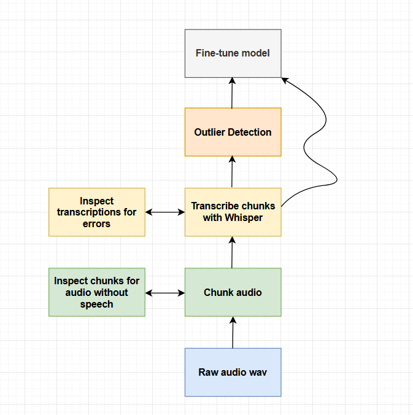

## Welcome

Hello, and welcome to our repo!

This project shows how to fine-tune a single-speaker text-to-speech model using **Coqui AI’s XTTS v2**. Below you’ll find setup instructions, key scripts, and a high-level overview of the data preparation and fine-tuning process.

---

## Getting Started

To begin fine-tuning XTTS v2, you'll need a few dependencies and scripts.

We recommend using the actively maintained XTTS repo from [Idiap Research Institute](https://github.com/idiap/coqui-ai-TTS/tree/dev).

Please follow their guide for downloading and installing. Ideally, you should have it installed locally if you're planning to do more than just inference.

---

## Key Scripts

- **`create_dataset_sentences.py`**  
  This script prepares the dataset by chunking and cleaning raw audio input.  
  ⚠️ *Note:* It’s set to pull audio from a URL by default, but you can modify it to use a local `.wav` file instead.

- **`fine_tune.py`**  
  Use this to launch the fine-tuning process with your prepared dataset.

---

## System Requirements

- **CUDA & cuDNN:** Required for running `create_dataset_sentences.py`.  
  Get cuDNN here: [NVIDIA cuDNN](https://developer.nvidia.com/cudnn)

- **OpenAI Whisper:** Used during the transcription step of dataset creation.  
  Available at: [https://github.com/openai/whisper](https://github.com/openai/whisper)

💡 *Note:* If you lack CUDA support, fine-tuning may not be feasible. However, if you just lack cuDNN then an alternative notebook (`create_dataset.ipynb`) is provided in the `notes/` directory for basic dataset creation. You will need to do outlier detection or manually remove chunks without complete or proper sentences.

---

## Workflow Overview

The diagram below summarizes the entire fine-tuning pipeline, from raw audio to a customized TTS model:

---

